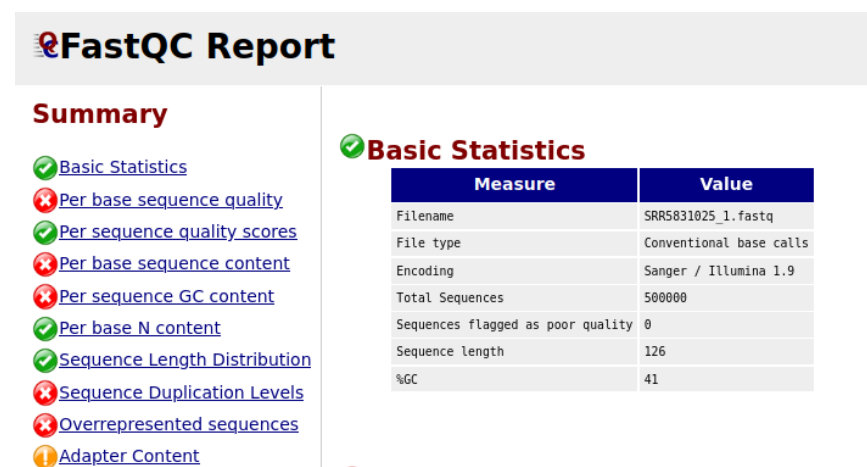
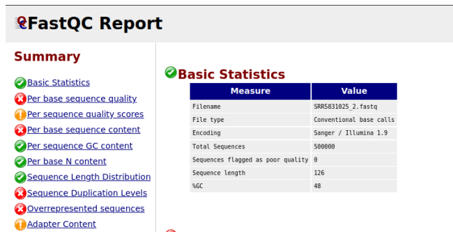
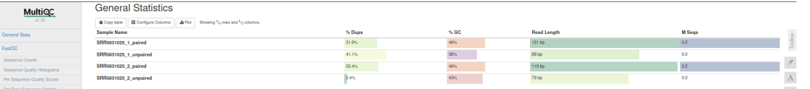
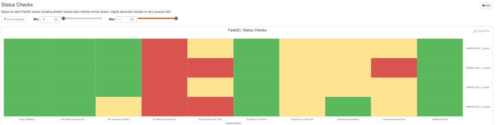
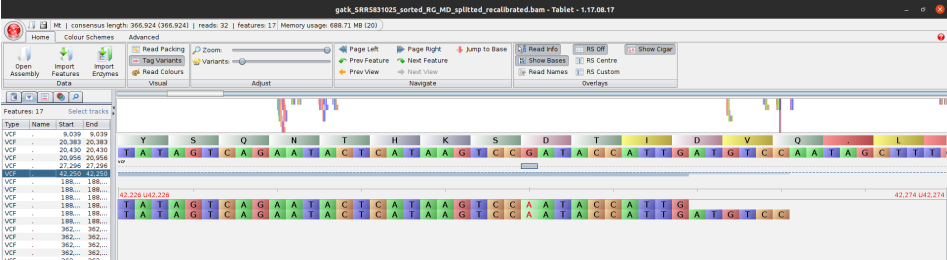
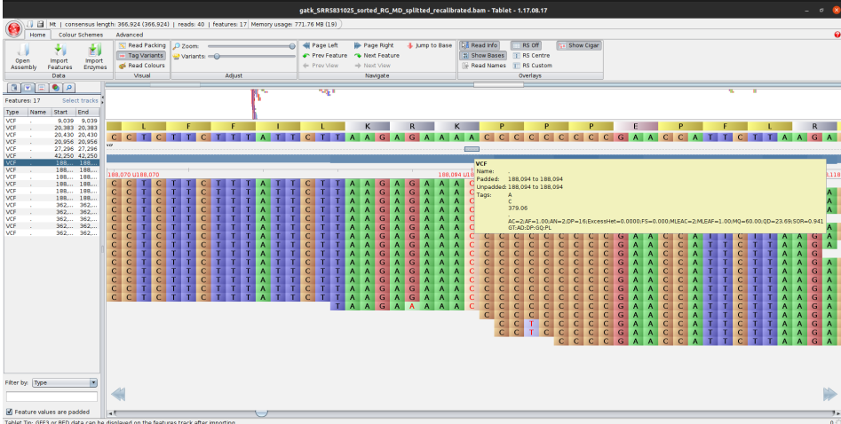
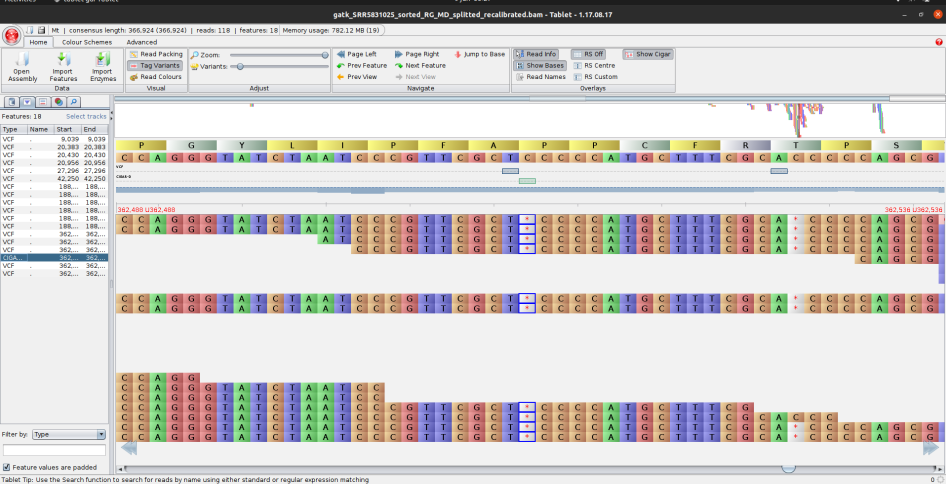

# Introduction

The aim of this project was to analyze gene expression in *Arabidopsis thaliana* under different conditions.  
The project focused on identifying differentially expressed genes, visualizing expression patterns, and interpreting the biological significance of the findings.  

# Methods

- **Organism:** *Arabidopsis thaliana*  
- **Sample:** SRA: https://www.ncbi.nlm.nih.gov/biosample/SAMN07357157
- **Experimental setup:**  
  - GEO Accession: GSM2704829
- **Analysis tools:**  
  - Gene analysis was preformed in conda environment with the following packages: sra-tools, trimmomatic, multiqc, star, subread, entrez-direct, bedparse and GATK.
    

# Results

- **Quality of the sequences:**  

{width=70%}

{width=70%}

  - Fastqc was run to determine the quality of the sequences. 
    - One of the more important tests they both fail is **Per base sequence quality**, which can be explained due to signal decay or phasing. No other worrisome signs are present, so the sequencing data from the facility is of good quality. With this plot we are looking primarily for overclustering and instrumental breakdowns.
    - At **per sequence quality score** test the plot gives you the average quality score on the x-axis and the number of sequences with that average on the y-axis. Majority of our reads have a high average quality score with no large bumps at the lower quality values.
    - **Per base sequence plot content** always gives a FAIL for RNA-seq data. This is because the first 10-12 bases result from the ‘random’ hexamer priming that occurs during RNA-seq library preparation.
    - **Per sequence GC content** plot gives the GC distribution over all sequences. Generally it is a good idea to note whether the GC content of the central peak corresponds to the expected % GC for the organism. Also, the distribution should be normal unless over-represented sequences (sharp peaks on a normal distribution) or contamination with another organism (broad peak). Our results of the first fastqc show a sharp peak on the normal distribution,  which is why this test failed.
    - **Sequence duplication levels** plot can help identify a low complexity library, which could result from too many cycles of PCR amplification or too little starting material. For RNA-seq we don’t normally do anything to address this in the analysis, but if this were a pilot experiment, we might adjust the number of PCR cycles, amount of input, or amount of sequencing for future libraries.
    - The **Overrepresented sequences** table is another important module as it displays the sequences (at least 20 bp) that occur in more than 0.1% of the total number of sequences. This table aids in identifying contamination, such as vector or adapter sequences. If the %GC content was off in the above module, this table can help identify the source. Our reads still include illumina adaptors, which is why this test failed.
    - Overall the results are favorable for continuation of the analysis. Trimmomatic can be used to remove illumina adaptors.
  
- **MultiQC**
   - With multiqc we are checking if the quality has improved compared to the fastqc results. Our data now passed Per base sequence quality, Per sequence quality score, and Adapter content. All tests still failed per base sequence content, which is expected as it fails for all RNA-seq data. The unpaired data also failed per sequence GC content, however the following analysis will be performed only on the paired data. Other tests showed
  improvement.
 
 

- **First mapping**
   - Star was used to map our sequences to the reference genome (http://ftp.ebi.ac.uk/ensemblgenomes/pub/release-53/plants/gff3/arabidopsis_thaliana). 
   - Results show very good mapping quality: 94.5 uniqully mapped reads which shows that the reads are high qualityand match the reference genome. 2.5% of multi-mapped reads wich is excpected due to repetitive regions or gene families.
   - Aligment details show that no big trimmings were necessary for alias averagw mapped length 239.28 matches input read length. Rate of mismatch was only 0.12%
   - Splices detected 115,122.
  - This dataset is highly suitable for downstream RNA-seq analysis (quantification, DEGs, etc.).

- **Second mapping**
   - Input reads: 201,409 (same as before).
   - Uniquely mapped reads: 190,413 → 94.54% (slightly higher than first pass 94.50%).
   - Multi-mapping: 2.49% → almost identical to first pass.
   - Unmapped reads: ~2.9% (also stable).
   - Big changes seen in splice junctions:
     - More splices detected: 126,731 (vs. 115,122 in first pass).
     - In second pass where GTF annotation is provided star annotated 125,506 (vs. 0 befour) splice junctions, confirming both the quality of the sequencing data and the accuracy of the mapping. The improved alignment supports reliable downstream gene quantification and expression analysis.

- **Featurecounts:**  
    - Featurecouts was used for counting aligned reads per gene. 
      - Features : 313952 
      - Total alignments : 202232
      - Successfully assigned alignments : 185213 (91.6%)
  
- **Variant discovery with GATK**  
    - Multiple variants were detected:
      - Known variation from guanine to adenine
        
      - Known SNP from adenine to cytosine.
        
  
      - Known deletion from TC to T, and known deletion from AC to A.
         
