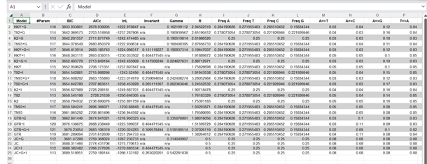
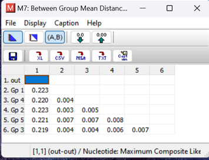

# Introduction

Phylogeographic studies of the house mouse (*Mus musculus*) are important for understanding the ancestry of laboratory strains, which are widely used as model organisms (Yang et al., 2007, 2011). Insights into population structure and subspecific status are crucial for biomedical use and for generating new laboratory strains. Both mice and rats have adapted to human settlements and agriculture. Reconstructing their dispersal has revealed informative links between human (pre)historic migrations, geopolitical events, and the geographic distribution of rodent mtDNA haplotypes (Aplin et al., 2011; Matisoo-Smith et al., 1998).

The Norway rat (*Rattus norvegicus*) is globally distributed but, unlike the black rat (*Rattus rattus*), has been less studied using molecular markers (Yang et al., 2007, 2011). It is the wild ancestor of the laboratory rat, yet its ancestry remains poorly understood (Canzian, 1997). Fossil evidence suggests that *R. norvegicus* originated in southern China rather than central-eastern Asia as previously believed (Lin et al., 2012). Fossils dated to 1.2–1.6 million years ago from northern China represent ancestral forms, while the species itself appears to have settled ~0.14 million years ago, later spreading across China and neighboring regions (Wu & Wang, 2012). During the Middle Ages the species dispersed worldwide, reaching North America in the 18th century and Africa in the 19th (Aplin et al., 2003; Long, 2003).

Molecular data can help clarify the origin, diversity, and migration patterns of the Norway rat, providing insights into laboratory strains and their genetic diversity compared to wild populations. 

**Hypothesis:** The Norway rat originated in southern China rather than central-eastern Asia.

**Genomic region analyzed:** 549 bp region of the mitochondrial cytochrome b (Cyt-b) gene.

# Materials and Methods

- **Sequences:** 52 mitochondrial Cyt-b sequences of *R. norvegicus* (from Song et al., 2014, GenBank accessions). Outgroups: 5 *Mus musculus domesticus*, 6 *Cavia porcellus*.  
- **Geographic sources:** China, Indonesia, Japan, Cambodia, Mongolia, South Pacific, Thailand, USA, Vietnam, South Africa, Denmark, France, Germany, Sweden.  
- **Tools used:**  
  - Sequence alignment: MEGA11, MUSCLE.  
  - Phylogenetic models: MEGA11 (HKY+G, HKY+I, JC).  
  - Haplotype analysis: DnaSP v6.  
  - Network analysis: PopART.  

# Results

## Sequence alignment

- 63 sequences, 492 bp after trimming.  
- 398 conserved sites, 94 variable, 85 parsimony-informative, 9 singletons.  

## Haplotypes
- 17 haplotypes identified.  
- Haplotype diversity: 0.897.  
- Nucleotide diversity (π): ~0.005.  

## Phylogeny

- Best-fit model: HKY+G.

- Phylogenetic tree separated major clades:  
  - African & European samples,  
  - Chinese samples,  
  - Southeast Asian samples (Vietnam, Thailand, Cambodia).  
- Outgroups (*Mus*, *Cavia*) formed distinct clades.  

## Genetic distances
- Smallest net genetic distances between European/African and Chinese clades (~0.003–0.004).  

- Largest distances were to outgroups (~0.145–0.151).  

## Haplotype networks
- Median joining network placed haplotype C11 (China) at the center, connected to 9 other haplotypes.  

 
- Indicates China as a likely origin of ancestral haplotypes.  

# Discussion

- Our results support previous findings that the Norway rat originated in China.  
- Differences with Song et al. (2014) likely due to smaller sample size and lower bootstrap replication.  
- Haplotypes show clear geographic clustering, with Chinese haplotypes spread throughout the network.  
- Historical human activity (migration, trade) likely facilitated global dispersal.  
- Rodent eradication efforts (e.g., rodenticides in the 20th century) may have affected population size and mtDNA diversity.  

# Conclusion

- The Norway rat most likely originated in China and spread globally via human activity.  
- Phylogeographic analysis of mtDNA provides valuable insights for both evolutionary biology and biomedical applications of laboratory rats.  

# References
- Aplin, K. P., Suzuki, H., Chinen, A. A., Chesser, R. T., ten Have, J., Donnellan, S. C., Austin, J., Frost, A., Gonzalez, J. P., Herbreteau, V., Catzeflis, F., Soubrier, J., Fang, Y.-P., Robins, J., Matisoo-Smith, E., Bastos, A. D. S., Maryanto, I., Sinaga, M. H., Denys, C., … Cooper, A. (2011). Multiple Geographic Origins of Commensalism and Complex Dispersal History of Black Rats. PLoS ONE, 6(11), e26357. https://doi.org/10.1371/journal.pone.0026357
- Aplin KP, Chesser T, & ten Have J. (2003). Evolution biology of the genus Rattus: profile of an archetypal rodent pest. V Singleton GR, Hinds LA, Krebs CJ, & Spratt DM (Ur.), Rats, mice and people: rodent biology and management. .
BOYLE, C. M. (1960). Case of Apparent Resistance of Rattus norvegicus Berkenhout to Anticoagulant Poisons. Nature, 188(4749), 517–517. https://doi.org/10.1038/188517a0
- Canzian, F. (1997). Phylogenetics of the laboratory rat Rattus norvegicus. Genome Research, 7(3), 262–267. https://doi.org/10.1101/gr.7.3.262
- Jin, C., Qin, D., Pan, W., Tang, Z., Liu, J., Wang, Y., Deng, C., Zhang, Y., Dong, W., & Tong, H. (2009). A newly discovered Gigantopithecus fauna from Sanhe Cave, Chongzuo, Guangxi, South China. Science Bulletin, 54(5), 788–797. https://doi.org/10.1007/s11434-008-0531-y
- Leigh, J. W., & Bryant, D. (2015). popart: full‐feature software for haplotype network construction. Methods in Ecology and Evolution, 6(9), 1110–1116. https://doi.org/10.1111/2041-210X.12410
- Lin, X.-D., Guo, W.-P., Wang, W., Zou, Y., Hao, Z.-Y., Zhou, D.-J., Dong, X., Qu, Y.-G., Li, M.-H., Tian, H.-F., Wen, J.-F., Plyusnin, A., Xu, J., & Zhang, Y.-Z. (2012). Migration of Norway Rats 
